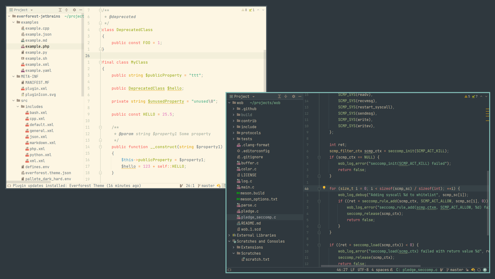

# Everforest JetBrains theme

[](https://github.com/francma/everforest-jetbrains/actions/workflows/test.yml)

The goal of this project is to provide pixel to pixel copy
of [sainnhe/everforest](https://github.com/sainnhe/everforest)
theme for JetBrains based IDEs with sane build system (without Java).



## Current status

Only a few languages are supported. Expect broken syntax highlighting if you don't use the programming languages from the list below.

- C
- C++
- JSON
- PHP
- XML
- Bash
- Markdown
- Python
- YAML
- JavaScript

## Installation

### From sources

Install dependencies:

- POSIX shell
- GNU Make
- envsubst (part of GNU gettext)
- zip

All above is most likely already included in base of your Linux distribution.

To build the theme, just run:

```shell
make release
```

Go to Plugins and locate the `everforest.jar` file.

## Contribution guide

All colors should match to how it looks in [NeoVim with Everforest theme](https://github.com/sainnhe/everforest) selected and
[treesitter](https://github.com/nvim-treesitter/nvim-treesitter) enabled. There are example files for each language
in `examples` folder.

If unsure on what color to use for elements not present in vim, you can take a look at [Color Pallete and Highlighting Semantics](https://github.com/antoineco/sainnhe-everforest/blob/palette/palette.md).

### Adding a new language

The goal is to have `<language>.xml` file inside `src/includes` folder in the following format:

```xml
<!-- BRACES AND OPERATORS -->
<!-- Braces -->
<option name="PHP_BRACES">
<value>
    <option name="FOREGROUND" value="${fg}"/>
</value>
</option>
<!-- Brackets -->
<option name="PHP_BRACKETS">
<value>
    <option name="FOREGROUND" value="${fg}"/>
</value>
</option>

<!-- CLASSES AND PROPERTIES -->
<!-- Class -->
<option name="PHP_CLASS">
<value>
    <option name="FOREGROUND" value="${yellow}"/>
</value>
</option>
```

Where the CAPITALIZED comments correspond to foldable categories.
Make sure to have `<options>` in the same order as they are in the IDE setting window.
Leave "Inherit values from" unticked to prevent random breakage of colors when changing the parent colors.

## License

ISC, see [LICENSE](/LICENSE).
